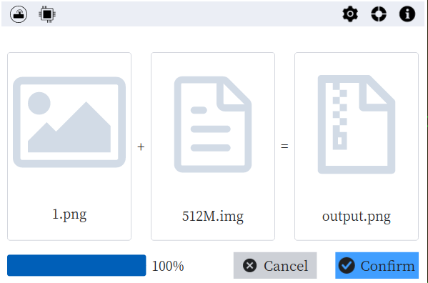

[中文文档](./README.zh-CN.md)

#### Introduction
It is a small tool that can write encrypt data to end of another file. And It would not break the source file format. Support file format: bmp, png, jpg, gif, exe, pdf, jar, rar, mp4.

#### Features
- [x] write encrypt data to the end of source file.
- [x] recover encrypt data from the target file.

#### How to build?
- Install `Rust` and `Cargo`
- Run `make`
- Refer to [Makefile](./Makefile) for more information

#### Reference
- [Slint Language Documentation](https://slint-ui.com/releases/1.0.0/docs/slint/)
- [github/slint-ui](https://github.com/slint-ui/slint)
- [Viewer for Slint](https://github.com/slint-ui/slint/tree/master/tools/viewer)
- [LSP (Language Server Protocol) Server for Slint](https://github.com/slint-ui/slint/tree/master/tools/lsp)
