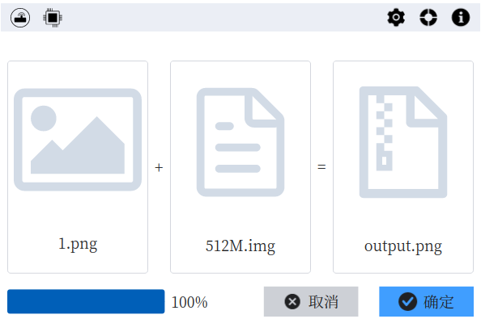

[English Documentation](./README.md)

#### 简介
文件隐写工具, 在源文件后添加加密数据，而且不破坏源文件的格式。目前支持文件格式：bmp, png, jpg, gif, exe, pdf, jar, rar, mp4.

#### 功能
- [x] 写入附件到源文件
- [x] 从目标文件中恢复附件

#### 如何构建?
- 安装 `Rust` 和 `Cargo`
- 运行 `make`
- 参考 [Makefile](./Makefile) 了解更多信息

#### 参考
- [Slint Language Documentation](https://slint-ui.com/releases/1.0.0/docs/slint/)
- [github/slint-ui](https://github.com/slint-ui/slint)
- [Viewer for Slint](https://github.com/slint-ui/slint/tree/master/tools/viewer)
- [LSP (Language Server Protocol) Server for Slint](https://github.com/slint-ui/slint/tree/master/tools/lsp)

